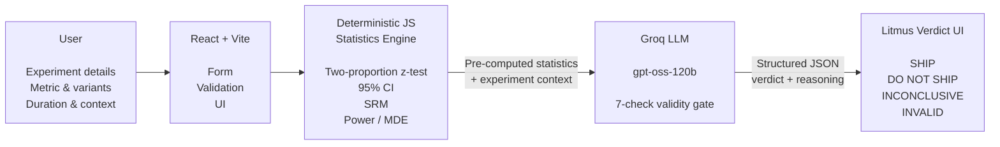

# Litmus

**A/B test validity critic. Significance isn't proof.**

## Problem

Product managers and analysts who run A/B tests but aren't experimentation specialists can read a p-value; they can't reliably spot the things that make a "significant" result untrustworthy.

The typical flow: eyeball the conversion lift, look at the p-value, declare a winner, ship. That misses everything the headline number hides — a broken randomization (sample-ratio mismatch), an underpowered test, a run too short to clear weekly cycles, peeking, or an effect too large to be real.

The pain in one sentence: *"My test came back significant, so I shipped, and the win vanished in production — because the result was never trustworthy to begin with."*

Enterprise platforms like Statsig and Eppo catch these. A solo PM with a spreadsheet has nothing between "the number looks good" and shipping.

## What it does

Litmus is a readout critic. You enter the experiment — what changed, the metric, per-variant users and conversions, the split, duration, an optional guardrail metric, whether you peeked, and an optional prior from a past test — and Litmus does three things:

1. **Computes the statistics deterministically in code** (significance, 95% CI, sample-ratio check, minimum detectable effect).
2. **Sends the numbers plus context to an LLM** that runs a seven-check validity gate: SRM, power, duration, metric fit, guardrail, peeking, effect-size plausibility.
3. **Returns a verdict** — `SHIP`, `DO NOT SHIP`, `INCONCLUSIVE`, or `INVALID` — with a colour-coded panel showing which checks passed, plain-English reasoning, and a recommended next step.

If the experiment is broken, a fatal flaw overrides statistical significance. Litmus refuses to read the result and tells you what to fix. The point isn't to compute significance — it's to stop you trusting a significant result you shouldn't.

## Architecture

The load-bearing decision: **deterministic math lives in code, judgment lives in the LLM.**



The two-proportion z-test, SRM chi-square, and power/MDE calculations run client-side in JavaScript. The LLM never touches arithmetic. It receives the pre-computed statistics plus context, applies the seven-check validity gate, and returns structured JSON — with gating logic that forces `INVALID` on any fatal flaw regardless of significance.

This boundary is what separates Litmus from a chatbot that hallucinates a p-value. The numbers are trustworthy because they're deterministic; the AI is still doing real reasoning, just not the arithmetic.

## Key Decisions

**Stats in code, not in the LLM.** LLMs hallucinate arithmetic. A trust tool cannot have untrustworthy inputs.

**Gating architecture over a single blended score.** A significant result on a broken experiment isn't a weak signal to average in — it's meaningless. Folding it into a composite score launders bad data behind a confident-looking number. A fatal flaw makes Litmus refuse to read the result rather than average it away.

**Domain-aware judgment with no invented benchmarks.** Duration and guardrail expectations differ by domain, so the model tailors what to check — but never fabricates "industry-standard" figures. It reasons about what to look at, never what the answer should be.

Building this changed how I read A/B tests. The statistically significant results are often the least trustworthy — a big lift and a clean p-value are exactly the pattern most likely to hide a broken split. Building the gate made me trust significance less, not more.

## How I'd Measure Success

**North Star:** % of analyses where the user follows Litmus's verdict — ships, holds, or reruns as advised. The tool only succeeds if it changes decisions, not if it's merely viewed.

**Supporting metrics:** *catch rate* (% of statistically significant results Litmus flags as untrustworthy — the core value made measurable), *time from input to verdict* (must feel instant, or people skip it and ship on gut), *repeat usage* per user per week (signal that Litmus has become part of how they make calls, not a one-time novelty).

**Guardrail:** *false-alarm rate* — % of verdicts users later mark as wrong or overcautious. This must not rise; over-flagging erodes trust as fast as under-flagging, and a tool that cries wolf gets ignored.

## What I Cut

**Continuous metrics** (revenue-per-user, time-on-task). Binary conversion covers most product A/B tests; supporting means-based tests would have doubled the statistics and the input UX. Binary-only kept the engine shippable in a day.

**Accounts, history, saved experiments.** Core value is one trustworthy readout, not a dashboard.

**Long-tail validity threats** (interaction effects, network effects, Simpson's paradox). Bounded the gate to the seven checks that catch the most common, most damaging mistakes. A finite, well-chosen gate beats an exhaustive one I couldn't finish or defend.

**Server-side API proxy.** Calling Groq from the frontend was enough for a demo. A proxy is the production-correct fix — noted explicitly rather than pretended away.

## Roadmap

**Near-term UX**
- **Reset control** next to Analyze so users can evaluate consecutive experiments without reloading the page.
- **Smart metric input** — dropdown of common product metrics (conversion rate, signup completion, click-through, etc.) with free-text fallback for domain-specific metrics.

**Analytical coverage**
- **Continuous metrics** (revenue-per-user, AOV, time-on-task) with appropriate tests — biggest expansion of what Litmus can evaluate.
- **Sequential-testing mode** with peeking-aware stopping rules.

**Position shift**
- **Sample-size calculator (Evan Miller-style)** that sizes tests before they run — moves Litmus from post-hoc critic to upfront guardrail.

**Long-term (dependent on adding user accounts)**
- **Personalized metric suggestions** — surface each user's most-recent or most-used metrics at the top of the dropdown. Requires the account/history layer that v1 deliberately cut, and only earns its place once the account surface pays for itself in other ways.

## Stack

- **Frontend and hosting:** Bolt.new (React + Vite)
- **LLM:** Groq API, `openai/gpt-oss-120b` — chosen for reasoning quality plus free-tier inference speed
- **Statistics:** TypeScript, client-side

## Local Setup

```bash
npm install
cp .env.example .env
# Add your Groq API key to .env: VITE_GROQ_API_KEY=gsk_...
npm run dev
```

Free Groq API key: https://console.groq.com
